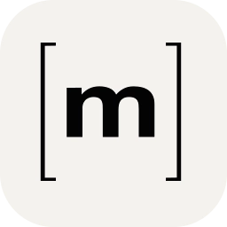
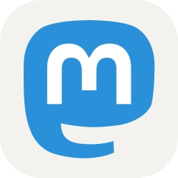

### Hi there 👋

## About Me
 - Electrical Technician
 - Programmer
 - Blogger
 - Geek
 - Daddy

## My Profiles

## Active Projects
 - [`AdGuardHome-Lists`](https://github.com/dontobi/AdGuardHome-Lists) Personal Lists for AdGuard Home
 - [`MotionEye.rpi`](https://github.com/dontobi/MotionEye.rpi) Docker Container - MotionEye (ARMv7, ARM64)
 - [`nextcloud-client.rpi`](https://github.com/dontobi/nextcloud-client.rpi) Docker Container - Nextcloud Sync Client (ARMv7, ARM64)

## Archived Projects
- [`SpamCalllist`](https://github.com/dontobi/SpamCalllist) Phone numbers for blacklists
- [`SpeedFlux.rpi`](https://github.com/dontobi/SpeedFlux.rpi) Docker Container - Speedflux (ARMv7, ARM64)

## Used Plattforms, Operating Systems, Languages and Tools

