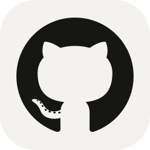

# Hi there 👋

## About Me
 - Electrical Technician and Programmer
 - Linux, Smart-Home and FOSS enthusiast
 - Feel free to reach out for any question

## My Profiles

## Active Projects
 - [`MotionEye.rpi`](https://github.com/dontobi/MotionEye.rpi) Docker Container - MotionEye (ARMv7, ARM64)
 - [`nextcloud-client.rpi`](https://github.com/dontobi/nextcloud-client.rpi) Docker Container - Nextcloud Sync Client (ARMv7, ARM64)

## Archived Projects
- [`AdGuardHome-Lists`](https://github.com/dontobi/AdGuardHome-Lists) Personal Lists for AdGuard Home
- [`gPodder2Go`](https://github.com/dontobi/gpodder2go) Docker Container - gPodder2Go (AMD64, ARM64)
- [`SpamCalllist`](https://github.com/dontobi/SpamCalllist) Phone numbers for blacklists
- [`SpeedFlux.rpi`](https://github.com/dontobi/SpeedFlux.rpi) Docker Container - Speedflux (ARMv7, ARM64)

## Used Plattforms, Operating Systems, Languages and Tools

